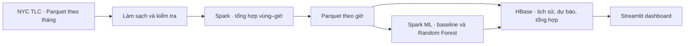

# NYC Taxi Demand Forecasting

Phân tích và dự báo số lượt đón taxi theo khu vực và giờ tại New York với **Apache Spark, Apache HBase, Random Forest và Streamlit**.

Dự án sử dụng dữ liệu **NYC TLC Yellow Taxi từ 01/2023 đến 12/2025** để xây dựng pipeline thu thập, làm sạch, tổng hợp, huấn luyện và trực quan hóa. Dashboard cho phép khám phá lịch sử nhu cầu và đối chiếu dự báo một giờ với số lượt đón thực tế trong năm 2025.

Đây là đồ án môn Nhập môn Big Data. Số chuyến được phục vụ phản ánh nhu cầu quan sát được, không bao gồm khách chưa được phục vụ hoặc toàn bộ giao thông công cộng. Spark và HBase chạy trên một máy để thực nghiệm, chưa phải cụm production.

## Chức năng

- **Tổng quan:** lượt đón, xu hướng theo ngày/tháng và các vùng có nhiều chuyến.
- **Bản đồ:** số lượt đón theo giờ trên ranh giới chính thức của 263 vùng taxi.
- **Phân tích vùng:** lịch sử theo giờ, so sánh khu vực và nhịp nhu cầu theo thứ.
- **Dự báo & kiểm chứng:** dự báo, baseline, dự phòng, số thực tế, sai số và xuất CSV.
- **Dữ liệu & mô hình:** nguồn, quy tắc xử lý, chia tập, đặc trưng và giới hạn.
- Giao diện **Light/Dark**, bố cục màn hình nhỏ và trạng thái kết nối HBase.

## Dữ liệu

Nguồn: [NYC TLC Trip Record Data](https://www.nyc.gov/site/tlc/about/tlc-trip-record-data.page). Yellow Taxi có dữ liệu công khai theo tháng, thời điểm đón và mã vùng phù hợp để xây dựng chuỗi số đếm theo giờ. Phạm vi ba năm hỗ trợ so sánh độ dài lịch sử và giữ một năm riêng để đánh giá.

| Lớp dữ liệu | Số dòng | Đơn vị |
|---|---:|---|
| Nguồn, 36 tháng 2023–2025 | 128.202.548 | Chuyến taxi |
| Sau làm sạch | 126.994.028 | Chuyến được giữ lại |
| Lưới theo giờ | 6.917.952 | Vùng–giờ |
| Train cuối, đủ đặc trưng | 4.367.904 | Vùng–giờ của 2023–2024 |
| Test 2025 hợp lệ | 2.291.256 | Vùng–giờ |
| Tổng hợp cho dashboard | 297.716 | Vùng–ngày hoặc vùng–tháng |

Bảng tổng hợp nhỏ hơn vì nhiều chuyến được cộng thành một số đếm. **297.716 dòng không phải tập train**: mô hình dùng lịch sử theo giờ, còn chuyến chi tiết được giữ trong Parquet. Tổng hợp ngày/tháng phục vụ các trang thống kê.

Pipeline giữ raw, lưu checksum và cách ly các dòng ngoài tháng nguồn, vùng không xác định hoặc thời lượng không dương. Giá trị thiếu được phân biệt với số 0. Timestamp nguồn không có UTC offset: ngày chuyển giờ DST vẫn giữ số đếm để phân tích nhưng không dùng làm nhãn huấn luyện/đánh giá. [Nguồn tải, schema và thống kê trước/sau](docs/DU_LIEU.md).

## Kiến trúc



| Thành phần | Vai trò |
|---|---|
| Parquet/PyArrow | Lưu chuyến đi, đọc theo batch, kiểm tra chất lượng |
| Spark 3.5.7 | Xử lý 36 tháng, tạo đặc trưng, huấn luyện và đánh giá |
| HBase 2.1.2 | Lưu/truy vấn lịch sử, dự báo và tổng hợp theo khóa vùng/thời gian |
| Streamlit/Plotly | Dashboard, bộ lọc, biểu đồ, bản đồ và kiểm chứng |
| Docker | Tái lập môi trường Spark/HBase; Spark chạy theo job |

## Mô hình và kết quả

Baseline dùng số chuyến **cùng giờ tuần trước**. Random Forest dùng số đếm trễ 1, 2, 24, 168 giờ; trung bình quá khứ 24/168 giờ; giờ, thứ và mã vùng. Đặc trưng chỉ lấy thông tin trước giờ đích.

Hai độ dài lịch sử (2024 và 2023–2024) được so sánh qua ba fold validation tháng 10, 11, 12/2024. Mỗi fold chỉ học từ thời gian trước tháng validation. Sau 12 lượt validation, phương án được khóa là **Random Forest 20 cây, maxDepth=12, lịch sử 2023–2024**. Model cuối học từ 2023–2024 rồi đánh giá trên năm 2025.

Thiếu đặc trưng: chuyển sang baseline; nếu thiếu lịch sử tuần, dùng trung bình vùng học từ train, cuối cùng là trung bình toàn train. Kết quả dưới đây tính trên cùng **2.291.256 nhãn test**, gồm các lượt dự phòng:

| Phương án | MAE · lượt/vùng–giờ | RMSE · lượt/vùng–giờ | WAPE |
|---|---:|---:|---:|
| Baseline | 5,320 | 17,320 | 25,50% |
| Random Forest + dự phòng | **3,851** | **11,753** | **18,46%** |

MAE giảm **27,61%** so với baseline. WAPE là tỷ lệ sai số tổng hợp, không phải accuracy. Sai số trung bình không bảo đảm từng điểm dự báo đạt cùng mức sai số.


[Chi tiết mô hình](docs/MO_HINH.md) · [Kết quả test](artifacts/metrics/stage4_final.json) · [Tổng kết thực nghiệm](docs/tong-ket/TONG_KET_GIAI_DOAN_4.md).

## Tiến độ

| Giai đoạn | Nội dung | Trạng thái |
|---|---|---|
| [1](docs/tong-ket/TONG_KET_GIAI_DOAN_1.md) | Môi trường, khảo sát và chọn nguồn dữ liệu | Hoàn thành |
| [2](docs/tong-ket/TONG_KET_GIAI_DOAN_2.md) | Làm sạch 36 tháng, chuẩn hóa schema, tạo lưới giờ | Hoàn thành |
| [3](docs/tong-ket/TONG_KET_GIAI_DOAN_3.md) | Spark, HBase, đối chiếu dữ liệu, sao lưu/phục hồi | Hoàn thành |
| [4](docs/tong-ket/TONG_KET_GIAI_DOAN_4.md) | Đặc trưng, baseline, Random Forest và đánh giá | Hoàn thành |
| [5](docs/tong-ket/TONG_KET_GIAI_DOAN_5.md) | Dashboard và kiểm chứng dự báo | Hoàn thành |
| 6 | Báo cáo Word, slide, sơ đồ và hồ sơ nộp đồ án | Chưa hoàn thành |

Mỗi giai đoạn có bản tổng kết về phạm vi, công việc, kết quả, bằng chứng và hạn chế. [Kế hoạch đầy đủ](docs/KE_HOACH.md).

## Cài đặt

Môi trường đã kiểm thử: **Windows, PowerShell, Python 3.13.16 x64, Docker Desktop với Linux containers**. Spark dùng Python 3.11/Java 17 trong Docker; không cần cài Java/Spark trực tiếp lên Windows. VSCode là tùy chọn.

```powershell
git clone https://github.com/VinhKhangIT2023/nyc-taxi-demand-forecasting.git
cd nyc-taxi-demand-forecasting
py -3.13 -m venv .venv
.\.venv\Scripts\python.exe -m pip install -r requirements.txt
.\.venv\Scripts\python.exe -m unittest discover -s tests
```

Trong VSCode, chọn **Python: Select Interpreter → .venv/Scripts/python.exe**. Có thể kích hoạt bằng `.\.venv\Scripts\Activate.ps1`; các lệnh dưới gọi Python trực tiếp nên không phụ thuộc activation. [Hướng dẫn môi trường](docs/CAI_DAT.md).

## Chuẩn bị dữ liệu và chạy ứng dụng

**Dataset, model và volume HBase không đi kèm repository.** Clone code không tự tạo các kết quả thực nghiệm. Máy mới cần chuẩn bị theo thứ tự:

1. [Tải và xử lý dữ liệu](docs/DU_LIEU.md): lookup, 36 file tháng, làm sạch và lưới theo giờ.
2. [Chạy Spark/HBase](docs/VAN_HANH.md): build image, xử lý, nạp và kiểm tra bảng lịch sử.
3. [Huấn luyện mô hình](docs/MO_HINH.md): đặc trưng, validation, khóa phương án và đánh giá test.
4. [Chuẩn bị dashboard](docs/DASHBOARD.md): snapshot phục vụ, ranh giới vùng và bảng dự báo/tổng hợp.

Từ thư mục gốc, khi dữ liệu và model đã sẵn sàng:

```powershell
docker compose -p bigdata-hbase -f docker/hbase/compose.yaml up -d
docker compose -p bigdata-hbase -f docker/hbase/compose.yaml ps
# Chờ HBase healthy. Chỉ chạy ba bước chuẩn bị trong lần đầu:
.\scripts\run_stage5.ps1 -Step Prepare
.\scripts\run_stage5.ps1 -Step Geometry
.\scripts\run_stage5.ps1 -Step Load
.\scripts\run_stage5.ps1 -Step App
```

Mở [http://127.0.0.1:8501](http://127.0.0.1:8501). Các lần sau chỉ cần bật HBase và chạy `-Step App`. Đổi giao diện qua **⋮ → Light/Dark**. Thrift HBase: `127.0.0.1:19090`; giao diện HBase: [localhost:16011](http://localhost:16011).

Demo gợi ý: **vùng 161, ngày 07/01/2025, 12:00** → xem dự báo → mở số thực tế → xem sai số. Dự báo được tính sẵn từ model đã kiểm chứng; chọn giờ không huấn luyện lại. Dừng Web bằng Ctrl+C; dừng HBase bằng:

```powershell
docker compose -p bigdata-hbase -f docker/hbase/compose.yaml stop
```

`stop` giữ volume; `down -v` xóa volume và dữ liệu HBase. Docker có thể lưu dữ liệu trên ổ hệ thống dù repo nằm ở ổ khác. [Dung lượng và vận hành](docs/VAN_HANH.md#dung-lượng-và-dọn-dẹp).

## Kiểm tra kết quả

- **36 unit tests** đạt tại lần kiểm tra giai đoạn 5.
- Spark đối chiếu đủ 36 tháng; HBase đối chiếu đủ 6.917.952 dòng lịch sử qua các lượt nạp/phục hồi.
- Model tải lại khớp toàn bộ 2.291.256 dự báo test.
- Bảng dashboard có đủ dự báo/tổng hợp, đối chiếu nguồn không sai lệch.
- Web đã kiểm tra các trang, CSV, DST, dự phòng, Light/Dark và điều hướng màn hình nhỏ.

Bằng chứng: [dữ liệu](artifacts/metrics/stage2_acceptance.json), [Spark/HBase](artifacts/metrics/stage3_full_acceptance.json), [mô hình](artifacts/metrics/stage4_acceptance.json), [dashboard](artifacts/metrics/stage5_acceptance.json). Đây là kết quả của lần thực nghiệm được lưu trong repo; xác minh trên máy mới cần chạy các bước tương ứng.

## Cấu trúc repository

```text
configs/                 Cấu hình chia tập, mô hình và dashboard
src/
  ingestion/             Tải, khảo sát và đọc dữ liệu
  processing/            Làm sạch, chuẩn hóa và tổng hợp Python/Spark
  storage/               Mã hóa, nạp và kiểm tra HBase
  models/                Đặc trưng, huấn luyện, đánh giá và biểu đồ
  dashboard/             Streamlit và truy vấn dữ liệu
scripts/                 Lệnh chạy giai đoạn và kiểm tra phục hồi
tests/                   Kiểm thử dữ liệu, lưu trữ, mô hình và Web
docker/                  Dockerfile, Compose và cấu hình dịch vụ
data/                    Dataset cục bộ; bị Git bỏ qua
artifacts/metrics/       Manifest và bằng chứng thực nghiệm nhỏ
artifacts/models/        Model sinh khi huấn luyện; bị Git bỏ qua
reports/                 Biểu đồ kết quả, báo cáo và slide
docs/                    Hướng dẫn, kế hoạch, quyết định và tổng kết
.streamlit/              Cấu hình giao diện/máy chủ Web
.vscode/                 Cấu hình editor dùng đường dẫn tương đối
```

## Tài liệu

| Nội dung | File |
|---|---|
| Cài đặt | [CAI_DAT.md](docs/CAI_DAT.md) |
| Nguồn, schema, làm sạch, chia tập | [DU_LIEU.md](docs/DU_LIEU.md) |
| Docker, Spark/HBase, nạp và phục hồi | [VAN_HANH.md](docs/VAN_HANH.md) |
| Đặc trưng, mô hình, đánh giá | [MO_HINH.md](docs/MO_HINH.md) |
| Chạy Web và kịch bản demo | [DASHBOARD.md](docs/DASHBOARD.md) |
| Kế hoạch sáu giai đoạn | [KE_HOACH.md](docs/KE_HOACH.md) |
| Lý do lựa chọn kỹ thuật | [QUYET_DINH.md](docs/QUYET_DINH.md) |
| Tổng kết từng giai đoạn | [docs/tong-ket/](docs/tong-ket/) |

`docs/LICH_SU.md` lưu thử nghiệm trước đây, không dùng để khởi tạo hiện hành. `docs/NHAT_KY_NHOM.md` dành cho ghi đóng góp thực tế của đồ án.

## File cục bộ và đầu ra sinh tự động

`.gitignore` loại `.venv/`, `.env`, cache, log, `.tools/`, dataset và model. Các thành phần sau không cần push:

| Nội dung | Cách tạo lại |
|---|---|
| `.venv/` | Tạo venv, cài `requirements.txt` |
| `data/raw/`, `data/reference/` | Lệnh tải dữ liệu; bước Geometry tải ranh giới |
| `data/interim/`, `data/processed/` | Pipeline xử lý, đặc trưng và dự báo |
| `artifacts/models/` | Huấn luyện bằng `scripts/run_stage4.ps1` |
| `__pycache__/`, cache, log | Sinh khi chạy chương trình |
| `.tools/` | Công cụ/file tạm cục bộ; backup tạo từ volume nguồn |
| Docker image/container/volume | Build/run Compose; volume cần nạp hoặc phục hồi |

Giữ **`docker/`, `.streamlit/`, code, configs và requirements** trên Git vì cần chạy lại. Giữ JSON/CSV kết quả nhỏ và biểu đồ được chọn để người đọc kiểm tra thực nghiệm; có thể sinh lại nhưng chúng không phải file rác. Lock theo giai đoạn giữ môi trường đã kiểm thử; `requirements.txt` trỏ tới lock hiện hành. `.gitkeep` chỉ giữ các thư mục trống cần cho dữ liệu/model/báo cáo.

## Giới hạn và hướng phát triển

Ứng dụng phát lại lịch sử năm 2025 và dự báo **một giờ**. Chưa có nguồn trực tiếp, dự báo 2026, dự báo nhiều bước hoặc khoảng bất định. Làm sạch được áp dụng hồi cứu; triển khai trực tiếp cần xác định độ trễ và thời điểm dữ liệu thực sự sẵn có.

Hướng mở rộng: đánh giá dữ liệu mới bằng phiên bản riêng, thử mô hình khác trên validation theo thời gian, xây khoảng bất định và phục vụ nhiều người dùng. Redis có thể bổ sung cache dùng chung nếu đo được nhu cầu; hiện dashboard dùng cache Streamlit và bảng HBase tổng hợp.
