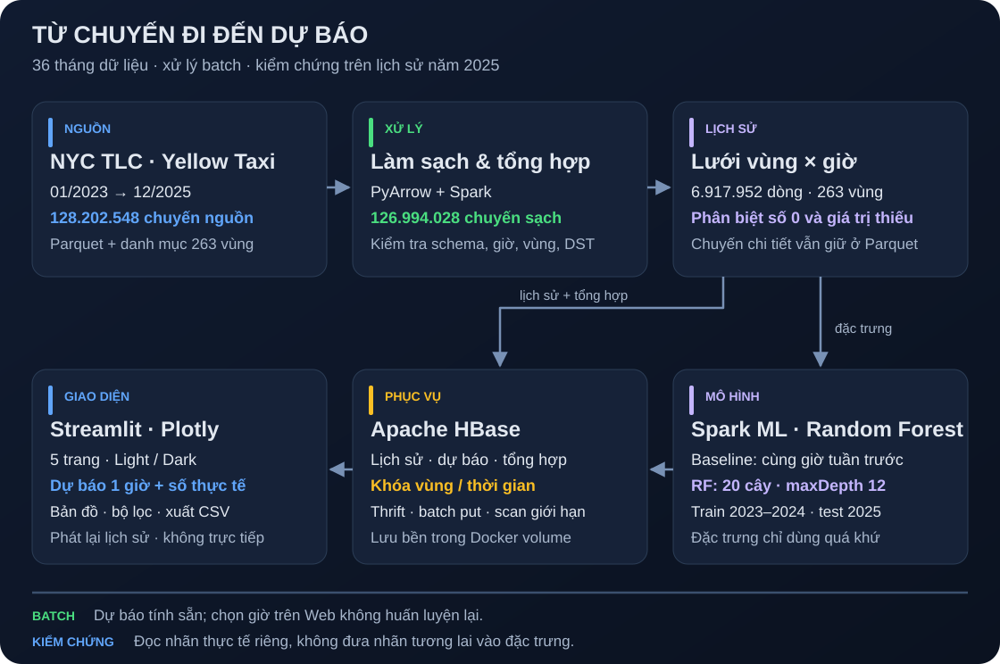

# Kế hoạch triển khai NYC Taxi Demand Forecasting

Dự án xây dựng pipeline phân tích và dự báo số lượt đón Yellow Taxi theo khu vực và giờ tại New York. Phạm vi thực nghiệm là 36 tháng từ 01/2023 đến 12/2025, với Spark xử lý dữ liệu và mô hình, HBase lưu các bảng phục vụ, Streamlit hiển thị kết quả.

## Các giai đoạn kỹ thuật

| Giai đoạn | Mục tiêu | Điều kiện hoàn thành | Tài liệu |
|---|---|---|---|
| 1 | Thiết lập môi trường và khảo sát nguồn | Có cấu trúc repo, môi trường riêng, nguồn tải và khảo sát ban đầu | [Tổng kết](tong-ket/TONG_KET_GIAI_DOAN_1.md) · [Cài đặt](CAI_DAT.md) |
| 2 | Chuẩn bị dữ liệu 2023–2025 | Đủ 36 tháng, quy tắc làm sạch có thống kê, schema thống nhất và lưới giờ có cờ chất lượng | [Tổng kết](tong-ket/TONG_KET_GIAI_DOAN_2.md) · [Dữ liệu](DU_LIEU.md) |
| 3 | Tích hợp Spark và HBase | Xử lý toàn phạm vi, ghi/đọc đúng, chạy lại không nhân đôi, kiểm tra phục hồi | [Tổng kết](tong-ket/TONG_KET_GIAI_DOAN_3.md) · [Vận hành](VAN_HANH.md) |
| 4 | Huấn luyện và đánh giá dự báo | Có baseline, validation theo thời gian, phương án khóa trước test và kết quả kiểm chứng | [Tổng kết](tong-ket/TONG_KET_GIAI_DOAN_4.md) · [Mô hình](MO_HINH.md) |
| 5 | Xây dashboard | Đọc dữ liệu thật từ HBase, phân tích vùng/thời gian, đối chiếu dự báo và kiểm tra UI | [Tổng kết](tong-ket/TONG_KET_GIAI_DOAN_5.md) · [Dashboard](DASHBOARD.md) |

Cả năm giai đoạn đã hoàn thành theo phạm vi thực nghiệm. Các bản tổng kết ghi công việc, số liệu, bằng chứng, quyết định và hạn chế tại từng mốc. Thử nghiệm ban đầu chỉ dùng mẫu nhỏ; phạm vi hiện hành được mô tả trong [DU_LIEU.md](DU_LIEU.md).

## Luồng triển khai

1. Tải Parquet và danh mục vùng từ NYC TLC; giữ raw, manifest và checksum.
2. Làm sạch theo quy tắc đã công bố, chuẩn hóa schema và tạo chuỗi vùng–giờ; phân biệt thiếu với 0.
3. Đối chiếu tổng hợp Spark với đầu ra chuẩn bị; nạp HBase qua khóa xác định và kiểm tra từng ô.
4. So sánh baseline với Random Forest trên validation tháng 10–12/2024; khóa cấu hình, học lại trên 2023–2024 và đánh giá riêng năm 2025.
5. Lưu dự báo tính sẵn, tổng hợp ngày/tháng và phục vụ dashboard. Nhãn thực tế được đọc riêng khi kiểm chứng.

## Tiêu chí chất lượng

- Có nguồn tải lại, phạm vi, checksum và thống kê trước/sau làm sạch.
- Không dùng thông tin tương lai trong đặc trưng, chọn vùng hoặc chọn cấu hình mô hình.
- Chạy lại không nhân đôi kết quả; dữ liệu HBase còn nguyên sau khởi động lại.
- Baseline và mô hình so sánh trên cùng nhãn test hợp lệ, có ghi số lượt dự phòng.
- Dashboard rõ đơn vị, phạm vi dữ liệu, mô hình và trạng thái lỗi/thiếu dữ liệu.
- Code, cấu hình, lock thư viện và kết quả nhỏ được công bố; dataset, model, môi trường và hồ sơ cá nhân giữ cục bộ.

## Giới hạn và mở rộng

Số chuyến đã phục vụ đại diện cho nhu cầu quan sát được. Timestamp nguồn không có UTC offset; các ngày DST giữ số đếm để phân tích nhưng không làm nhãn huấn luyện/đánh giá. Demo phát lại lịch sử và dự báo một giờ, chưa có nguồn trực tiếp hoặc dự báo năm 2026. Spark và HBase được thử trên một máy, chưa kiểm chứng cụm nhiều máy.

Mở rộng dữ liệu phải có phiên bản, kiểm tra chất lượng và đánh giá theo thời gian mới. Chỉ cân nhắc thêm mô hình, dự báo nhiều bước hoặc cache dùng chung sau khi xác định mục tiêu và đo được nhu cầu. [Các quyết định kỹ thuật](QUYET_DINH.md) ghi lý do của phương án đã triển khai.
