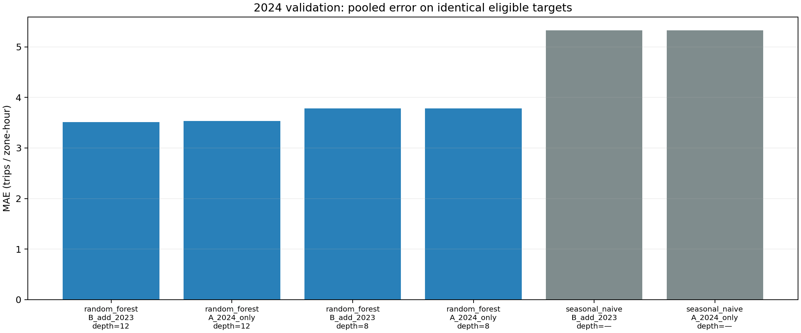
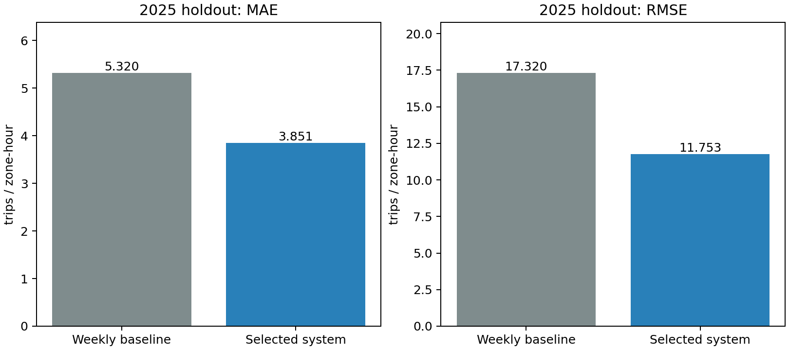
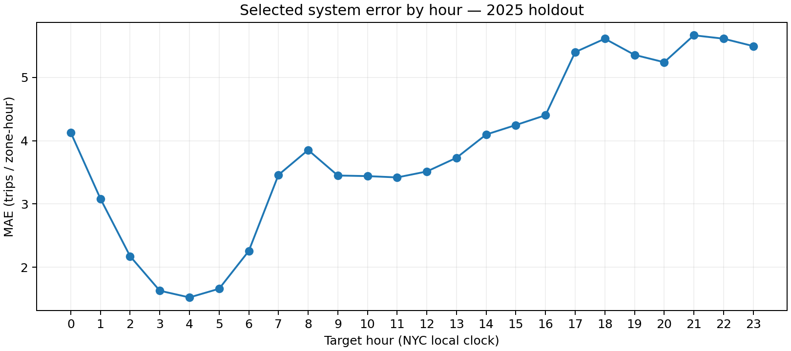

# Tổng kết giai đoạn 4 — Đặc trưng, huấn luyện và đánh giá

Trạng thái: **đã nghiệm thu giai đoạn 4**. Xác minh lúc 2026-10-08T12:14:03.620595+00:00.

## 1. Mục tiêu và phạm vi

Dự báo số chuyến đón ghi nhận trong một giờ tiếp theo tại 263 vùng. Lưới dữ liệu 2023–2025; chọn mô hình bằng ba fold tháng 10–12/2024, đánh giá cuối trên 2025 sau khi khóa lựa chọn.

## 2. Công việc và môi trường

- Đã tạo các lag 1, 2, 24, 168 giờ và trung bình 24/168 giờ chỉ từ nhãn quá khứ hợp lệ; giữ DST/null và giá trị 0 quan sát được. Kiểm tra sửa tương lai, ranh giới năm, thiếu giờ và tách vùng đạt.
- Baseline cùng giờ tuần trước và Random Forest 20 cây, depth 8/12; encoder chỉ fit trên train. Đã chạy đủ 12 lượt validation cho lịch sử A (2024) và B (thêm 2023).
- RF thiếu đầu vào dùng baseline; baseline thiếu lag tuần dùng trung bình vùng từ train, rồi toàn train. So sánh trên cùng tập nhãn và thống kê lượt dự phòng.
- Spark 3.5.7/Python 3.11/Java 17 trong image ML mở rộng NumPy 1.26.4. Windows Python 3.13, NumPy 2.2.6/Matplotlib 3.10.0 chỉ phục vụ kiểm tra và biểu đồ. File lớn và file tạm ghi trên D; HBase có thể dừng khi train.

## 3. Kết quả

- Đặc trưng: 6,917,952 dòng, 63.56 giây; 55,464,532 byte Parquet.
- Pilot: 151,488 dòng train; 42.06 giây tổng, 12.15 giây fit. Pilot chỉ kiểm tra vận hành.
- Phương án khóa: **random_forest, B_add_2023, depth=12**; MAE validation gộp 3.508892.
- Tổng 12 job validation: 1691.50 giây. Train cuối: 4,367,904 dòng đủ feature, 300.81 giây fit; 415.87 giây gồm đánh giá/lưu đầu ra.
- Test: 2,291,256 nhãn hợp lệ; macro MAE theo vùng 3.851490.

| Phương án | MAE (chuyến/vùng–giờ) | RMSE | WAPE |
|---|---:|---:|---:|
| Baseline với cùng độ dài lịch sử | 5.320124 | 17.320455 | 25.50% |
| Hệ thống đã chọn, gồm dự phòng | 3.851490 | 11.753467 | 18.46% |

Chênh lệch MAE so với baseline trên 2025: 27.61% cải thiện (âm nghĩa là kém hơn). Không dùng kết quả này để thay đổi mô hình đã khóa.

Lượt dự báo theo phương pháp: `{"random_forest": 2202888, "fallback_train_zone_mean": 12624, "fallback_weekly": 75744}`.
RF dùng dự phòng 88,368 lần (3.86% nếu RF là phương án phục vụ).

## 4. Bằng chứng và đầu ra

- [Nghiệm thu](../../artifacts/metrics/stage4_acceptance.json), [lựa chọn khóa](../../artifacts/metrics/stage4_selection.json), [đánh giá cuối](../../artifacts/metrics/stage4_final.json).
- Metrics từng fold, bảng CSV validation, số liệu theo vùng/giờ/tháng và nhóm nhu cầu từ train. Lưu checksum code/config/feature/model/predictions, seed, tham số, thời gian.
- Model ở `artifacts/models/stage4_final/`; predictions ở `data/processed/model_predictions_v1/test_2025/`, không push GitHub.
- Model nạp lại được đối chiếu toàn bộ 2,291,256 dự báo, gồm dự phòng, 0 sai lệch; toàn bộ nhãn test hợp lệ có dự báo. 27 unit tests và 5 nhóm kiểm tra cửa sổ Spark đạt.

## 5. Quyết định, hạn chế và công việc tiếp theo

Phương án và dự phòng đã được người dùng duyệt, ghi quyết định 014. Bảng validation so sánh hai độ dài lịch sử; không mặc định thêm dữ liệu sẽ tốt hơn.

RF tốt nhất với 2024 có MAE validation 3.530719; thêm 2023 đạt 3.508892, cải thiện 0.62%. Lợi ích lịch sử bổ sung nhỏ trong ba fold này; chưa kiểm định ý nghĩa thống kê và không suy ra càng thêm nhiều năm càng tốt. Năm 2025 chỉ đánh giá phương án đã khóa.

Các nhãn đã làm sạch hồi cứu, nguồn TLC không có tính sẵn có thời gian thực. Loại ngày DST khỏi nhãn test và công bố các dự báo dự phòng. Đánh giá một bước dùng giờ thực đã kết thúc, không chứng minh dự báo 24 giờ. Spark chạy một máy; chưa có khoảng bất định. Báo cáo Word/PPT hoàn chỉnh thuộc giai đoạn 6.

Giai đoạn 5: tích hợp truy vấn lịch sử và dự báo vào HBase/Streamlit, chọn mốc lịch sử phát lại, hiển thị model/version/nguồn dự phòng và sai số. Không cần tải hoặc làm sạch lại dataset.

Hướng dẫn: [MO_HINH.md](../MO_HINH.md). Chạy từng bước bằng `scripts/run_stage4.ps1`; giữ 2025 tách khỏi lựa chọn mô hình.
